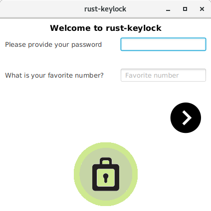
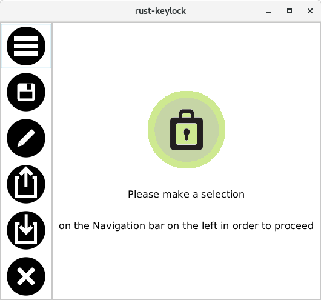
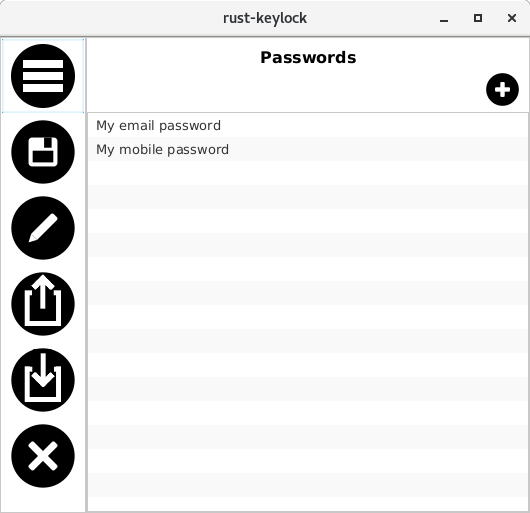
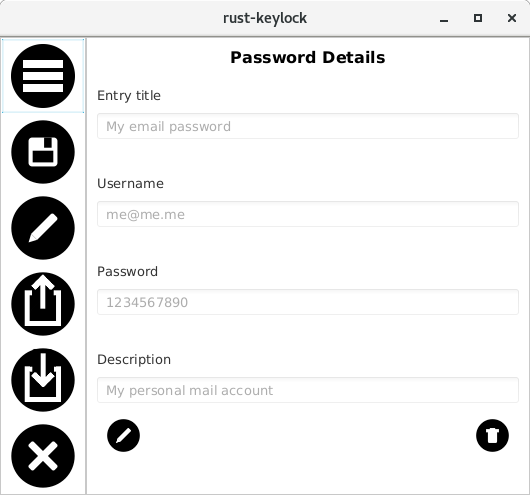

___rust-keylock-ui___ is the [Editor](https://rust-keylock.github.io/rust-keylock-lib/rust_keylock/trait.Editor.html) that manages the [rust-keylock-lib](https://github.com/rust-keylock/rust-keylock-lib), providing a User Interface using JavaFX (via [ScalaFX](http://www.scalafx.org)).

## Download and Install

Instructions can be found [here](https://rust-keylock.github.io/download/rkl/).

## Screenshots

