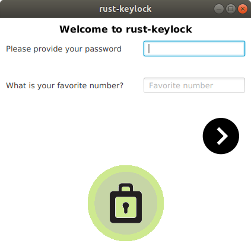
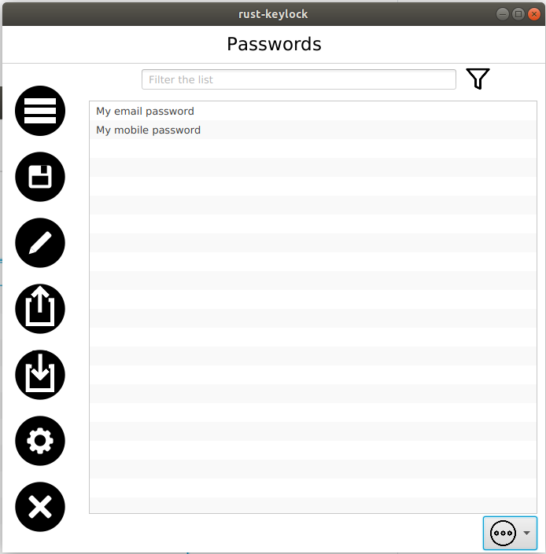
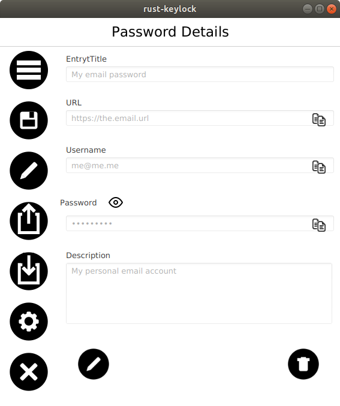
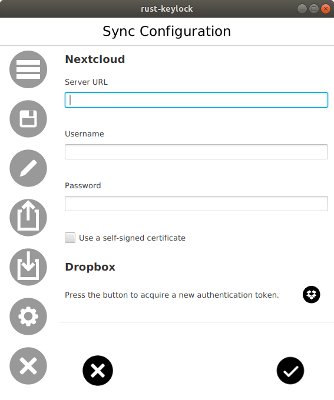

___rust-keylock___ is a password manager and its goals are to be:

* Secure
* Simple to use
* Portable
* Extensible

___rust-keylock-ui___ provides UI access to [rust-keylock-lib](https://github.com/rust-keylock/rust-keylock-lib), using JavaFX.

## Warning

The project has not yet received any formal / official security reviews. Use it at your own risk.

## Download and Install

Instructions can be found [here](https://rust-keylock.github.io/download/rkl/).

# More info

* [FAQ](https://rust-keylock.github.io/faq/rkl/) 
* [Wiki](https://rust-keylock.github.io/wiki/)

## Screenshots

